<style>
@page { size: Letter; margin: 2.2cm 2.2cm 2.2cm 2.5cm; }
body { font-family: "Liberation Sans", Arial, sans-serif; font-size: 11pt; line-height: 1.48; }
h1 { font-size: 22pt; margin-top: 28px; border-bottom: 2px solid currentColor; padding-bottom: 7px; }
h2 { font-size: 16pt; margin-top: 24px; }
h3 { font-size: 13pt; margin-top: 18px; }
p { text-align: justify; }
table { border-collapse: collapse; width: 100%; margin: 14px 0; font-size: 9.5pt; }
th { background: transparent; padding: 7px; border: 1px solid currentColor; }
td { background: transparent; padding: 7px; border: 1px solid currentColor; vertical-align: top; }
tr:nth-child(even) td { background: transparent; }
code { font-family: "Liberation Mono", monospace; font-size: 9pt; color: #111111; background: #eeeeee; border: 1px solid #d0d0d0; border-radius: 2px; padding: 1px 3px; }
pre { background: #ffffff; border-left: 4px solid #2f75b5; padding: 10px; white-space: pre-wrap; font-size: 8.5pt; }
blockquote { border-left: 4px solid #6ca0d5; background: #eef5fb; margin: 14px 0; padding: 8px 14px; }
figure { margin: 18px auto 24px auto; text-align: center; page-break-inside: avoid; }
figure img { max-width: 96%; max-height: 560px; object-fit: contain; border: 1px solid #bcc8d4; }
figcaption { font-size: 9pt; font-style: italic; margin-top: 6px; text-align: center; }
.cover { text-align: center; padding-top: 70px; min-height: 780px; page-break-after: always; }
.cover h1 { border: 0; font-size: 26pt; margin-top: 72px; }
.cover p { text-align: center; }
.cover .meta { margin-top: 90px; line-height: 1.9; }
.page-break { page-break-before: always; }
.answer-box { border: 1px solid currentColor; min-height: 150px; margin: 10px 0 26px; padding: 10px; }
.note { background: #fff8e6; border-left: 4px solid #e0a800; padding: 10px 14px; }
.center { text-align: center; }
</style>

<div class="cover">

<p><strong>UNIVERSIDAD DE SAN CARLOS DE GUATEMALA</strong><br>
<strong>FACULTAD DE INGENIERÍA</strong><br>
<strong>ESCUELA DE INGENIERÍA EN CIENCIAS Y SISTEMAS</strong></p>

<h1>Informe técnico: sistema NoSQL de inventario y ventas</h1>

<h2>Tarea2: Bases de Datos 2 NoSQL</h2>


<div class="meta">

<p><strong>Estudiante:</strong> Jairo Gómez<br>
<strong>Carné:</strong> 201902672<br>
<strong>Sección:</strong> N<br>
<strong>Docente:</strong> Joshua Alexander Vásquez del Águila<br>
<strong>Semestre:</strong> Segundo semestre de 2026<br>
<strong>Fecha de entrega:</strong> 25 de septiembre de 2026</p>

</div>
</div>

# Índice

1. Introducción  
2. Marco formativo  
3. Objetivos  
4. Tipo de base de datos NoSQL seleccionado  
5. Descripción del caso de estudio  
6. Uso de inteligencia artificial  
7. Análisis crítico y correcciones manuales  
8. Modelo implementado  
9. Implementación y carga de datos  
10. Operaciones CRUD  
11. Consultas relevantes  
12. Optimización mediante índices  
13. Conclusiones  
14. Reflexión individual  
15. Referencias técnicas

# 1. Introducción

Las bases de datos NoSQL ofrecen modelos flexibles para almacenar información cuyo formato no siempre se ajusta de manera natural a tablas rígidas. En esta tarea se desarrolló un sistema de inventario y ventas para una tienda comercial mediante MongoDB, una base de datos documental. La solución administra categorías, proveedores, productos y ventas, y permite registrar información, consultar existencias, modificar productos, eliminar registros temporales y obtener indicadores útiles para la toma de decisiones.

La inteligencia artificial generativa se utilizó como apoyo durante la propuesta inicial del modelo y la elaboración de comandos. Sus resultados no se adoptaron de forma automática: se contrastaron con los requisitos del caso, se probaron en MongoDB y se ajustaron manualmente. Entre los cambios más importantes se encuentran la separación de categorías y proveedores, el uso de enteros para los valores monetarios, la inclusión de validaciones de esquema, la conservación de datos históricos dentro de cada venta y la creación de un índice compuesto.

La implementación final contiene 45 documentos iniciales distribuidos en cuatro colecciones, una demostración completa de operaciones CRUD, tres consultas relevantes y evidencia de optimización con `explain("executionStats")`.

# 2. Marco formativo

## 2.1 Valor aplicado

| Valor | Aplicación en el laboratorio |
|---|---|
| Responsabilidad | Se verificaron las propuestas generadas por IA antes de incorporarlas. Cada comando fue ejecutado y sus resultados fueron documentados mediante capturas, evitando presentar contenido no validado como si fuera correcto. |

## 2.2 Competencias desarrolladas

| Tipo de competencia | Descripción |
|---|---|
| Competencia general | Diseñar e implementar soluciones de almacenamiento de datos seleccionando el paradigma de base de datos apropiado según las necesidades de un caso real. |
| Competencia específica | Modelar información de inventario y ventas en MongoDB; aplicar validaciones, operaciones CRUD, consultas y agregaciones; analizar planes de ejecución; y evaluar críticamente las recomendaciones de una herramienta de IA generativa. |

# 3. Objetivos

## 3.1 Objetivo general

Diseñar e implementar una base de datos documental funcional para gestionar el inventario y las ventas de una tienda, utilizando MongoDB e inteligencia artificial como herramienta de apoyo sujeta a validación técnica.

## 3.2 Objetivos específicos

- Modelar productos, categorías, proveedores y ventas mediante documentos BSON.
- Cargar al menos 20 registros y verificar su persistencia.
- Demostrar las operaciones de creación, lectura, actualización y eliminación.
- Ejecutar tres consultas que aporten información útil al negocio.
- Medir y mejorar el plan de ejecución de una consulta mediante un índice compuesto.
- Identificar limitaciones de la propuesta de IA y documentar las correcciones humanas realizadas.

# 4. Tipo de base de datos NoSQL seleccionado

Se eligió una base de datos **documental**, implementada con **MongoDB 8.0**. En este modelo, la información se almacena como documentos BSON agrupados en colecciones. Cada documento puede contener datos escalares, objetos anidados y arreglos, por lo que resulta apropiado para representar una venta completa junto con el cliente y el detalle de productos adquiridos.

MongoDB fue adecuado para este caso por las siguientes razones:

- Permite que la estructura de una venta se represente como una sola unidad lógica.
- Admite arreglos y subdocumentos para el detalle de productos.
- Facilita consultas operativas con `find()` y análisis con `aggregate()`.
- Ofrece validación mediante `$jsonSchema` sin perder la flexibilidad documental.
- Proporciona índices y estadísticas de ejecución para optimizar consultas.
- Puede desplegarse de forma reproducible mediante Docker Compose.

El diseño combina **referencias** y **datos embebidos**. Los productos referencian su categoría y proveedor mediante identificadores `ObjectId`, evitando duplicar estos catálogos. En cambio, las ventas embeben el cliente y una copia de los datos esenciales de cada producto, con el propósito de conservar el historial aunque el nombre o el precio actual del producto cambien posteriormente.

# 5. Descripción del caso de estudio

El escenario corresponde a una tienda que necesita controlar su catálogo, las existencias disponibles y las ventas realizadas. El sistema debe responder preguntas operativas como cuáles productos requieren reposición, qué artículos pertenecen a una categoría y cuáles han vendido más unidades.

Los procesos principales son:

1. Registrar categorías y proveedores.
2. Crear y mantener productos con SKU, precio, existencias y nivel mínimo.
3. Registrar ventas con cliente, productos, cantidades, subtotales y total.
4. Descontar existencias al preparar los datos de ventas confirmadas.
5. Consultar información útil para inventario y análisis comercial.

# 6. Uso de inteligencia artificial

La herramienta utilizada fue **ChatGPT de OpenAI**. Se empleó como asistente para proponer un modelo inicial y generar una primera versión de las operaciones CRUD. La propuesta fue considerada un punto de partida y luego fue revisada contra los requisitos funcionales y técnicos.

## 6.1 Propuesta inicial del modelo

La IA sugirió dos colecciones principales, `productos` y `ventas`, con un total de 35 documentos. La propuesta identificó correctamente las entidades centrales y recomendó que cada venta contuviera un arreglo de productos.

<figure>
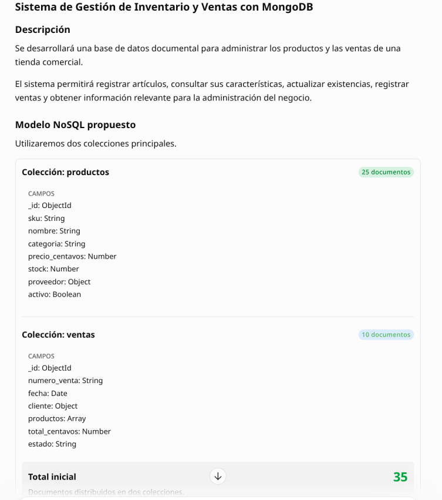
<figcaption>Figura 1. Propuesta inicial del sistema y de las colecciones productos y ventas.</figcaption>
</figure>

## 6.2 Generación asistida de operaciones CRUD

También se solicitó a la IA una guía para crear el archivo encargado de demostrar `insertOne()`, `findOne()`, `updateOne()` y `deleteOne()`. El código resultante se revisó y se fortaleció con comprobaciones de resultados, referencias existentes y validación del estado final.

<figure>
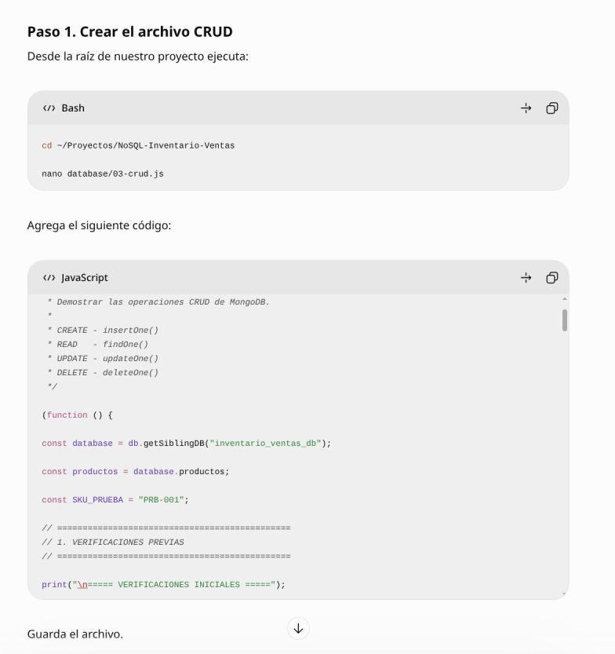
<figcaption>Figura 2. Interacción con la IA para construir la demostración CRUD.</figcaption>
</figure>

# 7. Análisis crítico y correcciones manuales

La respuesta de la IA fue útil para estructurar rápidamente una solución inicial, pero no cubrió por sí sola todos los aspectos necesarios para una implementación consistente. La revisión humana permitió detectar y corregir los siguientes puntos:

| Aspecto | Propuesta inicial de IA | Revisión o corrección manual | Justificación |
|---|---|---|---|
| Cantidad de colecciones | Dos colecciones: productos y ventas. | Se añadieron `categorias` y `proveedores`, para un total de cuatro. | Evita repetir nombres y datos de catálogos en cada producto y permite administrarlos de forma independiente. |
| Volumen inicial | 25 productos y 10 ventas: 35 documentos. | Se incorporaron 5 categorías y 5 proveedores: 45 documentos. | La solución final representa el dominio completo y supera el mínimo de 20 registros. |
| Categoría y proveedor | Campos simples o un objeto genérico dentro del producto. | Se utilizaron referencias `ObjectId` mediante `categoria_id` y `proveedor_id`. | Mejora la consistencia y permite reutilizar datos maestros. |
| Valores monetarios | Tipo numérico genérico. | Se almacenaron `precio_centavos`, `subtotal_centavos` y `total_centavos` con `NumberLong`. | Evita errores de precisión propios de los números decimales en cálculos monetarios. |
| Validación | La propuesta visual no definía reglas detalladas. | Se diseñaron esquemas `$jsonSchema`, campos obligatorios, mínimos, tipos BSON, patrón de correo y estados permitidos. | Rechaza documentos incompletos o con tipos incorrectos. |
| Historial de ventas | Arreglo de productos sin estrategia histórica explícita. | Cada detalle conserva `producto_id`, SKU, nombre, cantidad, precio unitario y subtotal. | Una venta pasada no cambia cuando se modifica el catálogo actual. |
| CRUD | Operaciones básicas. | Se añadieron verificaciones de `acknowledged`, `matchedCount`, `modifiedCount`, `deletedCount` y conteo final. | Permite comprobar que cada operación produjo exactamente el efecto esperado. |
| Consultas | Comandos generales. | Se crearon filtros con `$expr`, ordenamientos deterministas y una agregación con `$match`, `$unwind`, `$group`, `$sort`, `$limit` y `$project`. | Las consultas responden necesidades concretas del negocio y generan salidas verificables. |
| Rendimiento | Sin evidencia de optimización. | Se comparó el plan antes y después de un índice compuesto. | La mejora se sustenta con estadísticas reales, no únicamente con una recomendación teórica. |

Una limitación de la prueba es que el conjunto de datos es pequeño; por ello, el tiempo registrado fue de 0 ms tanto antes como después del índice. Sin embargo, el cambio del plan de `COLLSCAN` a `IXSCAN` y la reducción de 25 a 5 documentos examinados sí demuestran que el motor realizó menos trabajo. En un conjunto de producción más grande, esta diferencia tendría mayor impacto.

# 8. Modelo implementado

La base de datos se denomina `inventario_ventas_db` y contiene cuatro colecciones.

| Colección | Cantidad inicial | Función principal |
|---|---:|---|
| `categorias` | 5 | Catálogo de clasificación de productos. |
| `proveedores` | 5 | Datos de las empresas que suministran productos. |
| `productos` | 25 | Catálogo operativo con precio, stock y referencias. |
| `ventas` | 10 | Transacciones confirmadas con cliente y detalle histórico embebido. |
| **Total** | **45** | **Documentos cargados inicialmente.** |

## 8.1 Estructura de categorías

Cada categoría contiene `nombre`, `descripcion` y `activo`. El campo `activo` permite deshabilitar una categoría sin eliminarla físicamente.

## 8.2 Estructura de proveedores

Los proveedores almacenan `nombre`, `correo`, `telefono` y `activo`. El esquema verifica que el correo tenga una estructura básica válida.

## 8.3 Estructura de productos

Un producto incluye:

- `sku`: identificador comercial legible.
- `nombre`: descripción del producto.
- `categoria_id` y `proveedor_id`: referencias a catálogos.
- `precio_centavos`: valor monetario entero de 64 bits.
- `stock` y `stock_minimo`: existencias actuales y umbral de reposición.
- `activo`: estado lógico.
- `fecha_actualizacion`: fecha del último cambio.

## 8.4 Estructura de ventas

Cada venta contiene `numero_venta`, `fecha`, un objeto `cliente`, un arreglo `productos`, `total_centavos` y `estado`. El detalle embebido guarda la identificación y descripción histórica de cada producto junto con la cantidad, precio unitario y subtotal.

La relación lógica del modelo es la siguiente:

```text
categorias (1)  ─────< productos >─────  (1) proveedores
                         |
                         | producto_id + copia histórica
                         v
                      ventas[]
```

# 9. Implementación y carga de datos

## 9.1 Entorno de ejecución

MongoDB 8.0 se ejecutó en un contenedor definido en `docker-compose.yml`. El puerto se publicó únicamente en `127.0.0.1:27017`, reduciendo la exposición de la instancia. Las credenciales se reciben mediante variables de entorno y los datos se conservan en el volumen `mongo_data`.

La conexión se realizó desde MongoDB Compass con un usuario administrativo.

<figure>
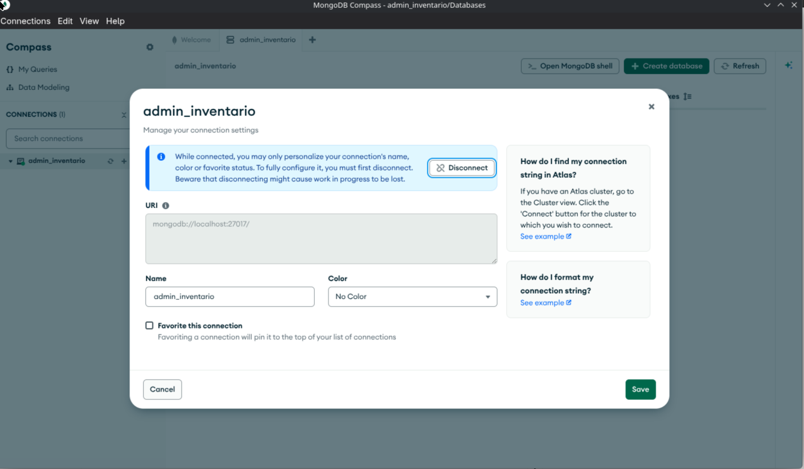
<figcaption>Figura 3. Configuración de la conexión local a MongoDB.</figcaption>
</figure>

## 9.2 Definición de Docker Compose

La infraestructura se definió con el siguiente archivo `docker-compose.yml`. Se utiliza la imagen oficial de MongoDB 8.0, un contenedor con nombre identificable, un volumen persistente y un puerto accesible solamente desde el equipo local.

```yaml
services:
  mongodb:
    image: mongo:8.0
    container_name: nosql_inventario_mongodb
    restart: unless-stopped
    environment:
      MONGO_INITDB_ROOT_USERNAME: ${MONGO_ROOT_USERNAME}
      MONGO_INITDB_ROOT_PASSWORD: ${MONGO_ROOT_PASSWORD}
    ports:
      - "127.0.0.1:27017:27017"
    volumes:
      - mongo_data:/data/db

volumes:
  mongo_data:
```

El servicio se inicia con el siguiente comando desde la raíz del proyecto:

```bash
docker compose up -d
```

## 9.3 Creación de colecciones

El archivo `database/01-colecciones.js` define los esquemas de las colecciones y emplea validación estricta. La evidencia muestra la ejecución del script y la disponibilidad de las cuatro colecciones del modelo.

<figure>
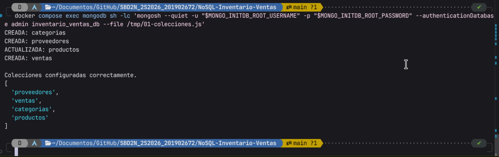
<figcaption>Figura 4. Ejecución del script de configuración de colecciones.</figcaption>
</figure>

## 9.4 Inserción y verificación de datos

El archivo `database/02-datos-iniciales.js` carga 5 categorías, 5 proveedores, 25 productos y 10 ventas. Antes de insertar, verifica que las colecciones estén vacías para evitar duplicados. Durante la construcción de las ventas también comprueba la existencia del producto y la disponibilidad de stock.

<figure>
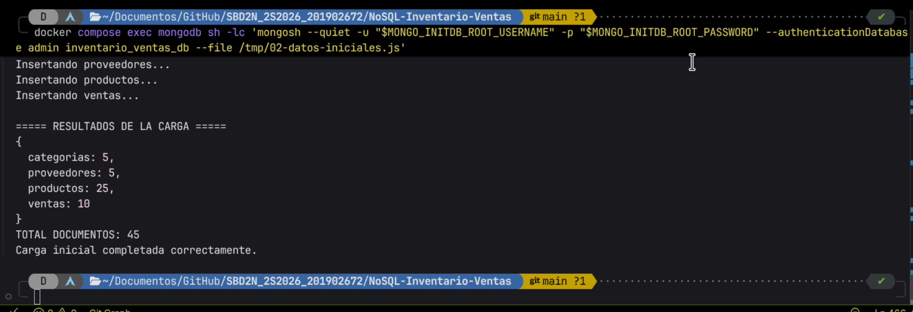
<figcaption>Figura 5. Carga inicial completada con 45 documentos.</figcaption>
</figure>

MongoDB Compass confirmó las cantidades almacenadas en cada colección.

<figure>
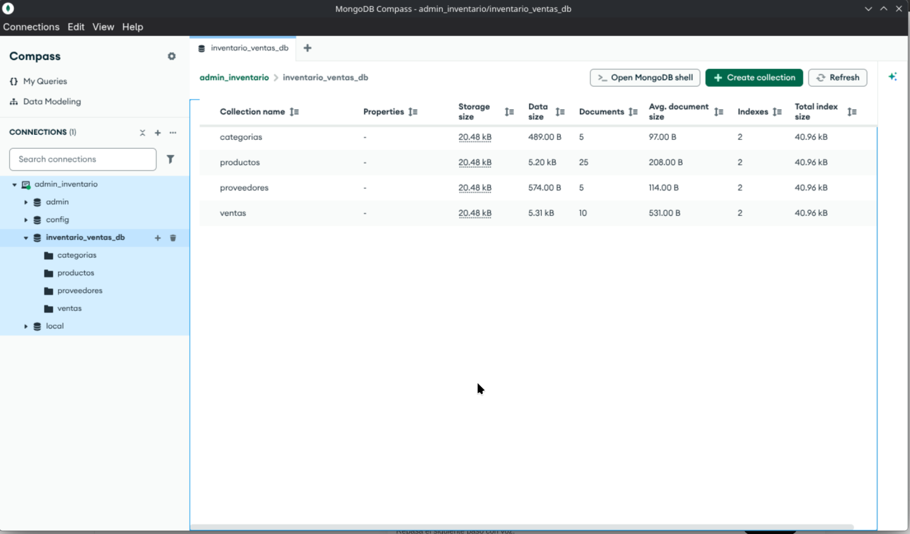
<figcaption>Figura 6. Colecciones creadas y documentos persistidos.</figcaption>
</figure>

# 10. Operaciones CRUD

El archivo `database/03-crud.js` utiliza el producto temporal con SKU `PRB-001`. Este enfoque permite demostrar las cuatro operaciones sin alterar permanentemente los 25 productos iniciales.

## 10.1 Create

`insertOne()` crea un producto de prueba con precio Q149.00, stock 10 y referencias existentes. Después se consulta el documento insertado para demostrar su persistencia.

<figure>
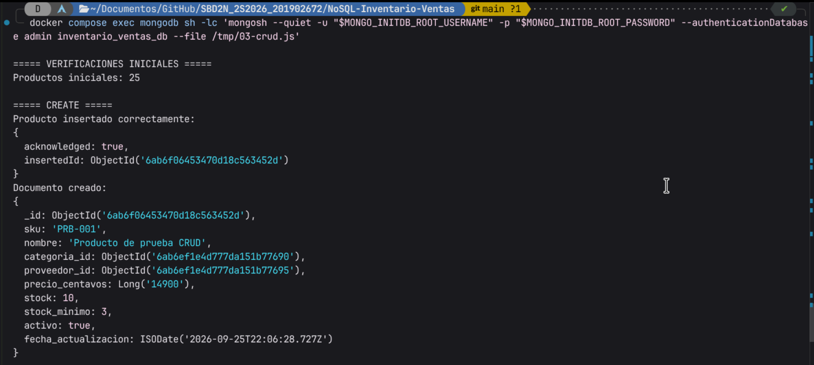
<figcaption>Figura 7. Inserción verificada del producto temporal.</figcaption>
</figure>

## 10.2 Read

`findOne()` localiza el producto por SKU y aplica una proyección para devolver únicamente los campos relevantes.

<figure>
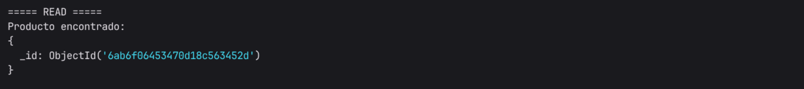
<figcaption>Figura 8. Lectura del producto temporal por su SKU.</figcaption>
</figure>

## 10.3 Update

`updateOne()` cambia el precio de Q149.00 a Q139.00 mediante `$set`, incrementa el stock de 10 a 15 mediante `$inc` y actualiza la fecha de modificación. El resultado confirma un documento encontrado y uno modificado.

<figure>
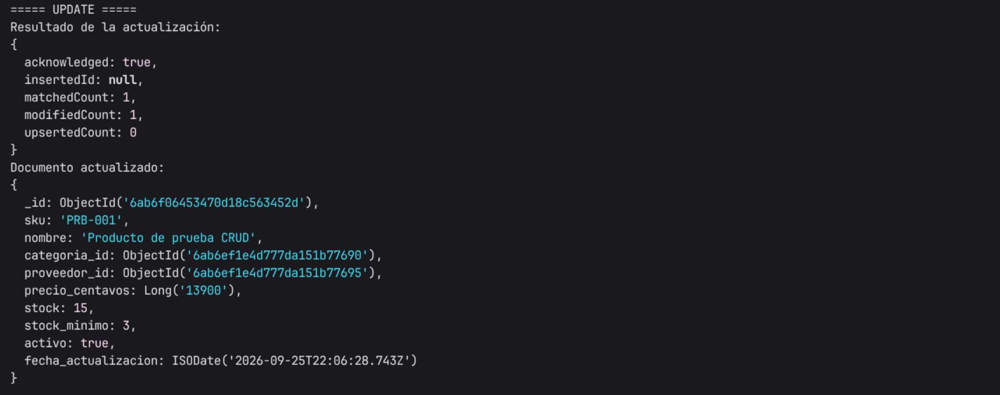
<figcaption>Figura 9. Actualización del precio y del inventario.</figcaption>
</figure>

## 10.4 Delete

`deleteOne()` elimina únicamente el producto temporal. La consulta posterior devuelve `null` y el conteo final regresa a 25 productos, por lo que la prueba no deja residuos.

<figure>
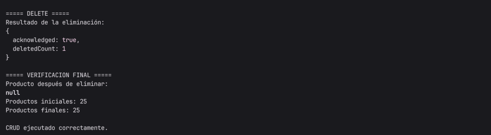
<figcaption>Figura 10. Eliminación y verificación final del producto temporal.</figcaption>
</figure>

<figure>
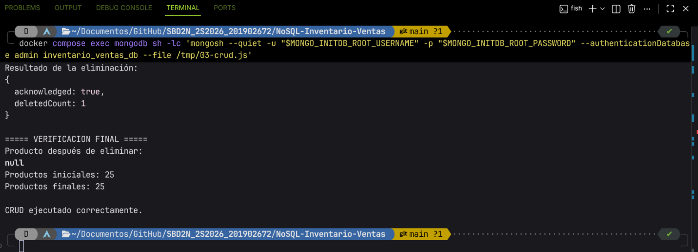
<figcaption>Figura 11. Confirmación de que el CRUD finalizó correctamente.</figcaption>
</figure>

# 11. Consultas relevantes

## 11.1 Ejecución de las consultas

Las consultas se definieron en `database/04-consultas.js`. Para ejecutarlas dentro del contenedor, primero se copió el archivo al directorio temporal de MongoDB y luego se invocó `mongosh` con las credenciales almacenadas en las variables de entorno del servicio.

```bash
docker cp database/04-consultas.js \
  nosql_inventario_mongodb:/tmp/04-consultas.js

docker compose exec mongodb sh -lc \
  'mongosh --quiet \
    -u "$MONGO_INITDB_ROOT_USERNAME" \
    -p "$MONGO_INITDB_ROOT_PASSWORD" \
    --authenticationDatabase admin \
    inventario_ventas_db \
    --file /tmp/04-consultas.js'
```

El archivo ejecuta las tres consultas de forma consecutiva y al final imprime un resumen con las cantidades obtenidas. Las Figuras 12 a 15 muestran la salida de esa ejecución.

## 11.2 Q1 — Productos con stock bajo

La primera consulta localiza productos activos cuyo `stock` es menor o igual que `stock_minimo`. Se utiliza `$expr` porque la comparación se realiza entre dos campos del mismo documento.

```javascript
db.productos.find({
  activo: true,
  $expr: { $lte: ["$stock", "$stock_minimo"] }
})
```

El resultado identificó **8 productos** que requieren atención de reposición. Esta consulta apoya las decisiones de compra y previene faltantes.

<figure>
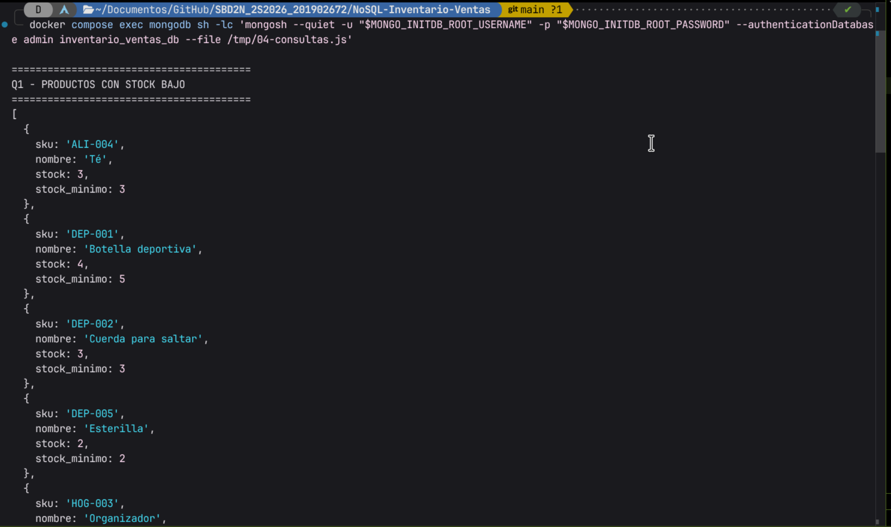
<figcaption>Figura 12. Q1: ocho productos con existencias iguales o inferiores al mínimo.</figcaption>
</figure>

## 11.3 Q2 — Productos por categoría y precio

La segunda consulta obtiene la categoría Tecnología, filtra sus productos activos y los ordena por precio ascendente y SKU. El SKU actúa como criterio secundario para producir un orden determinista cuando existen precios iguales.

```javascript
db.productos.find({
  categoria_id: categoria._id,
  activo: true
}).sort({ precio_centavos: 1, sku: 1 })
```

Se obtuvieron **5 productos** de la categoría Tecnología. La consulta permite revisar el catálogo de una línea específica y comparar precios.

<figure>
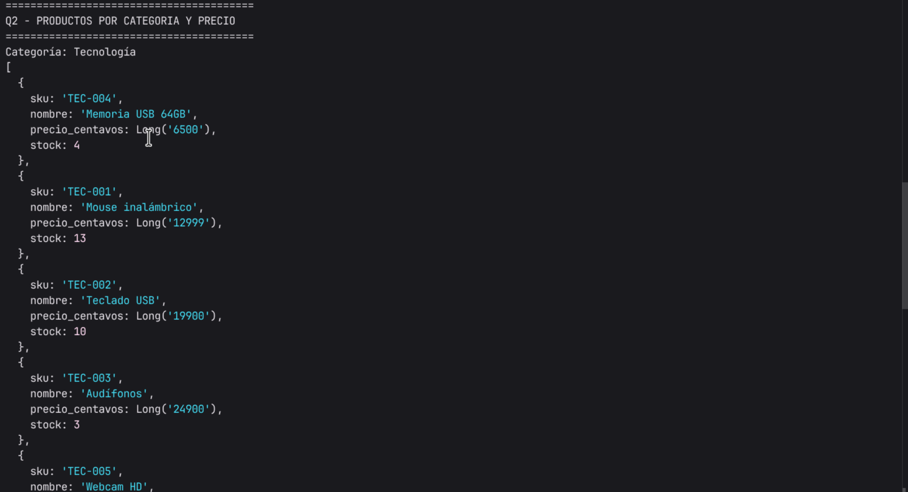
<figcaption>Figura 13. Q2: productos tecnológicos ordenados por precio.</figcaption>
</figure>

## 11.4 Q3 — Cinco productos más vendidos

La tercera consulta usa el framework de agregación. Primero conserva únicamente ventas confirmadas; después separa los elementos del arreglo con `$unwind`, agrupa por producto, suma las unidades y devuelve los primeros cinco registros.

```javascript
db.ventas.aggregate([
  { $match: { estado: "CONFIRMADA" } },
  { $unwind: "$productos" },
  { $group: {
      _id: "$productos.producto_id",
      sku: { $first: "$productos.sku" },
      nombre: { $first: "$productos.nombre" },
      unidades_vendidas: { $sum: "$productos.cantidad" }
  }},
  { $sort: { unidades_vendidas: -1, sku: 1 } },
  { $limit: 5 },
  { $project: { _id: 0, sku: 1, nombre: 1, unidades_vendidas: 1 } }
])
```

El ranking obtenido fue:

| Posición | SKU | Producto | Unidades vendidas |
|---:|---|---|---:|
| 1 | PAP-001 | Cuaderno universitario | 5 |
| 2 | PAP-002 | Bolígrafo azul | 5 |
| 3 | TEC-001 | Mouse inalámbrico | 5 |
| 4 | ALI-002 | Galletas | 4 |
| 5 | DEP-001 | Botella deportiva | 4 |

<figure>

<figcaption>Figura 14. Q3: clasificación de productos por unidades vendidas.</figcaption>
</figure>

El script consolidó los resultados de las tres consultas y confirmó su ejecución correcta.

<figure>
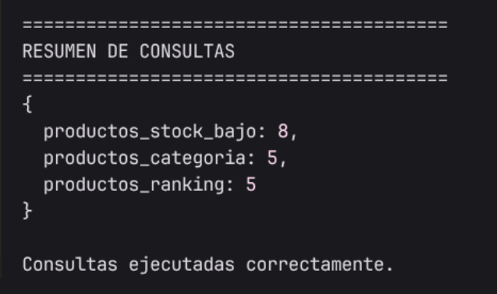
<figcaption>Figura 15. Resumen: 8 productos con stock bajo, 5 por categoría y 5 en el ranking.</figcaption>
</figure>

# 12. Optimización mediante índices

La consulta Q2 filtra por `categoria_id` y `activo`, y luego ordena por `precio_centavos` y `sku`. Por esa razón se diseñó el índice compuesto:

```javascript
db.productos.createIndex(
  { categoria_id: 1, activo: 1, precio_centavos: 1, sku: 1 },
  { name: "idx_categoria_activo_precio_sku" }
)
```

El orden de los campos sigue el patrón de igualdad antes de ordenamiento: primero aparecen los campos usados con coincidencia exacta y después los campos del `sort`.

## 12.1 Plan anterior

Antes del índice, MongoDB utilizó `COLLSCAN`, examinó los **25 documentos** de la colección, no examinó claves y devolvió 5 resultados.

<figure>
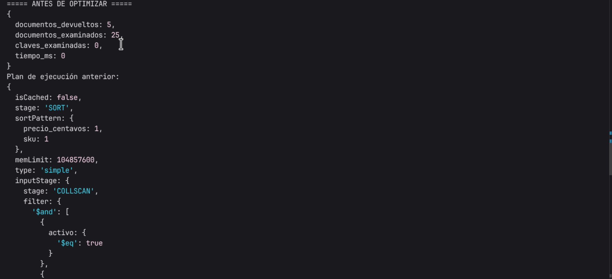
<figcaption>Figura 16. Plan anterior: escaneo completo de la colección.</figcaption>
</figure>

## 12.2 Plan optimizado

Después de crear el índice, el plan incorporó `IXSCAN`; examinó **5 claves** y **5 documentos** para devolver los mismos 5 resultados. Además, el índice satisfizo el orden solicitado.

<figure>

<figcaption>Figura 17. Plan optimizado con escaneo del índice compuesto.</figcaption>
</figure>

<figure>
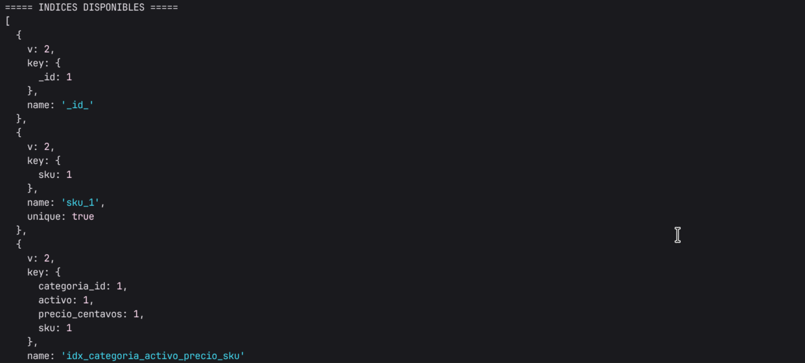
<figcaption>Figura 18. Verificación del índice compuesto disponible en productos.</figcaption>
</figure>

| Métrica | Antes | Después |
|---|---:|---:|
| Documentos devueltos | 5 | 5 |
| Documentos examinados | 25 | 5 |
| Claves examinadas | 0 | 5 |
| Etapa principal observada | `COLLSCAN` | `IXSCAN` |
| Tiempo en el conjunto de prueba | 0 ms | 0 ms |

El índice redujo en un **80 %** los documentos examinados: `(25 - 5) / 25 × 100`. Aunque el tiempo no varió por el tamaño reducido de la muestra, el plan posterior es más escalable.

# 13. Conclusiones

1. MongoDB permitió representar de forma natural las ventas mediante documentos con objetos y arreglos embebidos, mientras que las referencias conservaron separados los catálogos de categorías y proveedores.
2. La solución implementada cumplió el mínimo de registros al cargar 45 documentos y demostró operaciones CRUD completas sin modificar de forma permanente el conjunto inicial.
3. Las tres consultas desarrolladas aportan información accionable: alertas de reposición, exploración de productos por categoría y clasificación de los productos más vendidos.
4. El uso de enteros en centavos, validaciones de esquema y verificaciones explícitas fortaleció la integridad de los datos respecto de la propuesta inicial.
5. La IA fue útil para acelerar el modelado y la generación de comandos, pero la revisión humana fue necesaria para adaptar, probar, corregir y justificar la solución.
6. La medición con `explain("executionStats")` permitió comprobar que el índice compuesto redujo los documentos examinados y reemplazó el escaneo completo por un escaneo de índice.

<div class="page-break"></div>

# 14. Reflexión individual

Aunque la IA generativa puede acelerar la construcción de soluciones, no reemplaza la necesidad de conocimientos humanos. La revisión crítica, la comprensión del dominio y la validación técnica son esenciales para garantizar que el resultado final sea correcto, eficiente y útil para el negocio.

## 14.1 ¿La IA ayudó realmente al desarrollo?

Si, la IA proporcionó un punto de partida rápido para el modelo y los comandos CRUD. Sin embargo, su propuesta inicial no cumplía con todos los requisitos del caso de estudio, por lo que fue necesario realizar ajustes manuales significativos.

## 14.2 ¿Qué errores detectó?

La IA cometió varios errores, entre ellos:
- Proponer solo dos colecciones en lugar de cuatro, lo que habría generado duplicación de datos y dificultades de mantenimiento.
- No utilizar referencias para categorías y proveedores, lo que habría afectado la consistencia de los datos.
- Esquemas de validación incompletos, lo que podría haber permitido la inserción de documentos inválidos.
- No conservar datos históricos en las ventas, lo que habría dificultado el análisis de transacciones pasadas.
- Sugerir tipos de datos inadecuados para valores monetarios, lo que podría haber causado problemas de precisión en cálculos financieros.

## 14.3 ¿Qué conocimientos humanos fueron necesarios para corregir la solución?

- Comprender el dominio del negocio para identificar las entidades y relaciones correctas.
- Conocer las practicas de modelado de datos en MongoDB, incluyendo el uso de referencias y datos embebidos.
- Aplicar validaciones de esquema para garantizar la integridad de los datos.
- Diseñar consultas eficientes y comprender cómo optimizar el rendimiento mediante índices.
- Evaluar críticamente las recomendaciones de la IA y decidir cuándo aceptar, modificar o rechazar sus sugerencias.

## 14.4 ¿Qué riesgos existen al depender totalmente de IA?
- La IA puede generar soluciones que parecen correctas pero que contienen errores lógicos o técnicos.
- Puede no comprender completamente el contexto del negocio, lo que lleva a decisiones de diseño inapropiadas.
- La falta de revisión humana puede resultar en problemas de integridad de datos, rendimiento deficiente y dificultades de mantenimiento a largo plazo.
- La dependencia excesiva de la IA puede limitar el desarrollo de habilidades críticas y de resolución de problemas en los desarrolladores humanos.


# 15. Referencias técnicas

- MongoDB, *Documentación oficial: Data Modeling*. https://www.mongodb.com/docs/manual/data-modeling/
- MongoDB, *Documentación oficial: Schema Validation*. https://www.mongodb.com/docs/manual/core/schema-validation/
- MongoDB, *Documentación oficial: Aggregation Operations*. https://www.mongodb.com/docs/manual/aggregation/
- MongoDB, *Documentación oficial: explain Results*. https://www.mongodb.com/docs/manual/reference/explain-results/
- OpenAI, ChatGPT, herramienta de IA generativa utilizada como apoyo para la propuesta de modelo y comandos CRUD.

---
