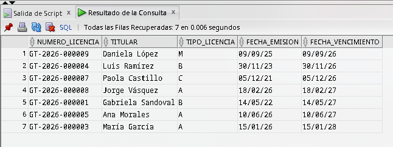
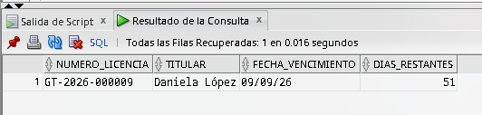
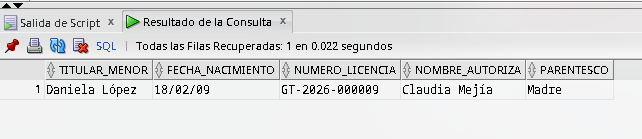
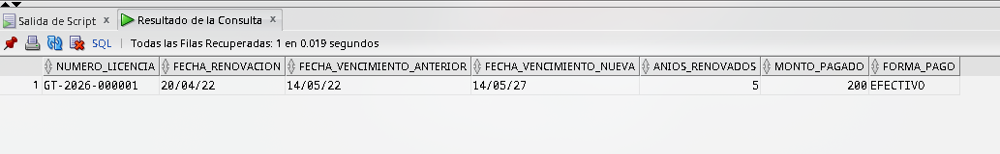
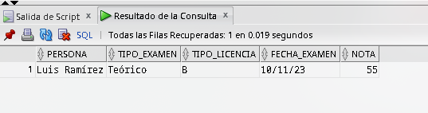

# Consultas SQL — Sistema de Emisión de Licencias (Guatemala)

---

## 1. Inserción de datos

### 1.1 PERSONA

```sql
INSERT INTO PERSONA (cui, primer_nombre, segundo_nombre, primer_apellido, segundo_apellido, fecha_nacimiento, genero, direccion, telefono) VALUES ('1234567890101', 'Juan', 'Carlos', 'Pérez', 'López', DATE '1990-05-14', 'M', 'Zona 1, Guatemala', '55512345');
INSERT INTO PERSONA (cui, primer_nombre, segundo_nombre, primer_apellido, segundo_apellido, fecha_nacimiento, genero, direccion, telefono) VALUES ('1234567890102', 'María', 'Fernanda', 'García', 'Morales', DATE '1985-03-22', 'F', 'Zona 10, Guatemala', '55512346');
INSERT INTO PERSONA (cui, primer_nombre, segundo_nombre, primer_apellido, segundo_apellido, fecha_nacimiento, genero, direccion, telefono) VALUES ('1234567890103', 'Luis', 'Alberto', 'Ramírez', 'Cruz', DATE '2010-01-15', 'M', 'Zona 7, Guatemala', '55512347');
INSERT INTO PERSONA (cui, primer_nombre, segundo_nombre, primer_apellido, segundo_apellido, fecha_nacimiento, genero, direccion, telefono) VALUES ('1234567890104', 'Ana', 'Sofía', 'Morales', 'Díaz', DATE '1995-11-30', 'F', 'Zona 5, Guatemala', '55512348');
INSERT INTO PERSONA (cui, primer_nombre, segundo_nombre, primer_apellido, segundo_apellido, fecha_nacimiento, genero, direccion, telefono) VALUES ('1234567890105', 'Carlos', 'Eduardo', 'Hernández', 'Gómez', DATE '2011-06-10', 'M', 'Zona 12, Guatemala', '55512349');
INSERT INTO PERSONA (cui, primer_nombre, segundo_nombre, primer_apellido, segundo_apellido, fecha_nacimiento, genero, direccion, telefono) VALUES ('1234567890106', 'Paola', 'Andrea', 'Castillo', 'Ruiz', DATE '1998-08-25', 'F', 'Zona 3, Guatemala', '55512350');
INSERT INTO PERSONA (cui, primer_nombre, segundo_nombre, primer_apellido, segundo_apellido, fecha_nacimiento, genero, direccion, telefono) VALUES ('1234567890107', 'Jorge', 'Mario', 'Vásquez', 'Pineda', DATE '1975-12-05', 'M', 'Zona 9, Guatemala', '55512351');
INSERT INTO PERSONA (cui, primer_nombre, segundo_nombre, primer_apellido, segundo_apellido, fecha_nacimiento, genero, direccion, telefono) VALUES ('1234567890108', 'Daniela', 'Isabel', 'López', 'Aguilar', DATE '2009-02-18', 'F', 'Zona 6, Guatemala', '55512352');
INSERT INTO PERSONA (cui, primer_nombre, segundo_nombre, primer_apellido, segundo_apellido, fecha_nacimiento, genero, direccion, telefono) VALUES ('1234567890109', 'Fernando', 'José', 'Ortiz', 'Mejía', DATE '2012-09-09', 'M', 'Zona 11, Guatemala', '55512353');
INSERT INTO PERSONA (cui, primer_nombre, segundo_nombre, primer_apellido, segundo_apellido, fecha_nacimiento, genero, direccion, telefono) VALUES ('1234567890110', 'Gabriela', 'Nicole', 'Sandoval', 'Reyes', DATE '1992-07-01', 'F', 'Zona 15, Guatemala', '55512354');
```

### 1.2 TIPO_EXAMEN

```sql
INSERT INTO TIPO_EXAMEN (nombre) VALUES ('Médico General');
INSERT INTO TIPO_EXAMEN (nombre) VALUES ('Psicométrico');
INSERT INTO TIPO_EXAMEN (nombre) VALUES ('Refrescamiento');
INSERT INTO TIPO_EXAMEN (nombre) VALUES ('Reconocimiento de Firma');
INSERT INTO TIPO_EXAMEN (nombre) VALUES ('Manejo Defensivo');
INSERT INTO TIPO_EXAMEN (nombre) VALUES ('Reexamen Práctico');
INSERT INTO TIPO_EXAMEN (nombre) VALUES ('Evaluación Auditiva');
```

### 1.3 EXAMEN

```sql
INSERT INTO EXAMEN (id_persona, id_tipo_examen, id_tipo_licencia, fecha_examen, resultado, nota) VALUES (1, 1, 2, DATE '2022-04-01', 'APROBADO', 85);
INSERT INTO EXAMEN (id_persona, id_tipo_examen, id_tipo_licencia, fecha_examen, resultado, nota) VALUES (1, 2, 2, DATE '2022-04-10', 'APROBADO', 90);
INSERT INTO EXAMEN (id_persona, id_tipo_examen, id_tipo_licencia, fecha_examen, resultado, nota) VALUES (2, 3, 2, DATE '2020-03-01', 'APROBADO', 100);
INSERT INTO EXAMEN (id_persona, id_tipo_examen, id_tipo_licencia, fecha_examen, resultado, nota) VALUES (3, 1, 1, DATE '2026-01-05', 'APROBADO', 78);
INSERT INTO EXAMEN (id_persona, id_tipo_examen, id_tipo_licencia, fecha_examen, resultado, nota) VALUES (3, 2, 1, DATE '2026-01-10', 'APROBADO', 82);
INSERT INTO EXAMEN (id_persona, id_tipo_examen, id_tipo_licencia, fecha_examen, resultado, nota) VALUES (4, 1, 2, DATE '2023-11-10', 'REPROBADO', 55);
INSERT INTO EXAMEN (id_persona, id_tipo_examen, id_tipo_licencia, fecha_examen, resultado, nota) VALUES (5, 3, 1, DATE '2026-06-01', 'APROBADO', 95);
INSERT INTO EXAMEN (id_persona, id_tipo_examen, id_tipo_licencia, fecha_examen, resultado, nota) VALUES (6, 2, 2, DATE '2019-08-10', 'APROBADO', 88);
INSERT INTO EXAMEN (id_persona, id_tipo_examen, id_tipo_licencia, fecha_examen, resultado, nota) VALUES (7, 1, 3, DATE '2021-11-20', 'APROBADO', 91);
INSERT INTO EXAMEN (id_persona, id_tipo_examen, id_tipo_licencia, fecha_examen, resultado, nota) VALUES (8, 1, 1, DATE '2026-02-01', 'APROBADO', 80);
```

### 1.4 CARTA_AUTORIZACION_MENOR

```sql
INSERT INTO CARTA_AUTORIZACION_MENOR (id_persona, nombre_autoriza, cui_autoriza, parentesco, fecha_emision) VALUES (3, 'Roberto Ramírez', '1111111110101', 'Padre', DATE '2026-01-05');
INSERT INTO CARTA_AUTORIZACION_MENOR (id_persona, nombre_autoriza, cui_autoriza, parentesco, fecha_emision) VALUES (5, 'Marta Gómez', '1111111110102', 'Madre', DATE '2026-06-01');
INSERT INTO CARTA_AUTORIZACION_MENOR (id_persona, nombre_autoriza, cui_autoriza, parentesco, fecha_emision) VALUES (8, 'Sergio López', '1111111110103', 'Padre', DATE '2026-02-01');
INSERT INTO CARTA_AUTORIZACION_MENOR (id_persona, nombre_autoriza, cui_autoriza, parentesco, fecha_emision) VALUES (9, 'Claudia Mejía', '1111111110104', 'Madre', DATE '2025-08-20');
```

### 1.5 LICENCIA

```sql
INSERT INTO LICENCIA (numero_licencia, id_persona, id_tipo_licencia, fecha_emision, fecha_vencimiento, estado) VALUES ('GT-2026-000001', 1, 2, DATE '2022-05-14', DATE '2027-05-14', 'VIGENTE');
INSERT INTO LICENCIA (numero_licencia, id_persona, id_tipo_licencia, fecha_emision, fecha_vencimiento, estado) VALUES ('GT-2026-000002', 2, 2, DATE '2020-03-22', DATE '2025-03-22', 'VENCIDA');
INSERT INTO LICENCIA (numero_licencia, id_persona, id_tipo_licencia, fecha_emision, fecha_vencimiento, estado) VALUES ('GT-2026-000003', 3, 1, DATE '2026-01-15', DATE '2028-01-15', 'VIGENTE');
INSERT INTO LICENCIA (numero_licencia, id_persona, id_tipo_licencia, fecha_emision, fecha_vencimiento, estado) VALUES ('GT-2026-000004', 4, 2, DATE '2023-11-30', DATE '2026-11-30', 'VIGENTE');
INSERT INTO LICENCIA (numero_licencia, id_persona, id_tipo_licencia, fecha_emision, fecha_vencimiento, estado) VALUES ('GT-2026-000005', 5, 1, DATE '2026-06-10', DATE '2027-06-10', 'VIGENTE');
INSERT INTO LICENCIA (numero_licencia, id_persona, id_tipo_licencia, fecha_emision, fecha_vencimiento, estado) VALUES ('GT-2026-000006', 6, 2, DATE '2019-08-25', DATE '2024-08-25', 'VENCIDA');
INSERT INTO LICENCIA (numero_licencia, id_persona, id_tipo_licencia, fecha_emision, fecha_vencimiento, estado) VALUES ('GT-2026-000007', 7, 3, DATE '2021-12-05', DATE '2026-12-05', 'VIGENTE');
INSERT INTO LICENCIA (numero_licencia, id_persona, id_tipo_licencia, fecha_emision, fecha_vencimiento, estado) VALUES ('GT-2026-000008', 8, 1, DATE '2026-02-18', DATE '2027-02-18', 'VIGENTE');
INSERT INTO LICENCIA (numero_licencia, id_persona, id_tipo_licencia, fecha_emision, fecha_vencimiento, estado) VALUES ('GT-2026-000009', 9, 4, DATE '2025-09-09', DATE '2026-09-09', 'VIGENTE');
INSERT INTO LICENCIA (numero_licencia, id_persona, id_tipo_licencia, fecha_emision, fecha_vencimiento, estado) VALUES ('GT-2026-000010', 10, 2, DATE '2018-07-01', DATE '2023-07-01', 'VENCIDA');
```

### 1.6 RENOVACION

```sql
INSERT INTO RENOVACION (id_licencia, id_tarifa, fecha_renovacion, fecha_vencimiento_anterior, fecha_vencimiento_nueva) VALUES (1, 5, DATE '2022-04-20', DATE '2022-05-14', DATE '2027-05-14');
INSERT INTO RENOVACION (id_licencia, id_tarifa, fecha_renovacion, fecha_vencimiento_anterior, fecha_vencimiento_nueva) VALUES (2, 5, DATE '2020-02-15', DATE '2020-03-22', DATE '2025-03-22');
INSERT INTO RENOVACION (id_licencia, id_tarifa, fecha_renovacion, fecha_vencimiento_anterior, fecha_vencimiento_nueva) VALUES (3, 2, DATE '2026-01-10', DATE '2026-01-15', DATE '2028-01-15');
INSERT INTO RENOVACION (id_licencia, id_tarifa, fecha_renovacion, fecha_vencimiento_anterior, fecha_vencimiento_nueva) VALUES (4, 3, DATE '2023-11-25', DATE '2023-11-30', DATE '2026-11-30');
INSERT INTO RENOVACION (id_licencia, id_tarifa, fecha_renovacion, fecha_vencimiento_anterior, fecha_vencimiento_nueva) VALUES (5, 1, DATE '2026-06-05', DATE '2026-06-10', DATE '2027-06-10');
INSERT INTO RENOVACION (id_licencia, id_tarifa, fecha_renovacion, fecha_vencimiento_anterior, fecha_vencimiento_nueva) VALUES (6, 5, DATE '2019-08-20', DATE '2019-08-25', DATE '2024-08-25');
INSERT INTO RENOVACION (id_licencia, id_tarifa, fecha_renovacion, fecha_vencimiento_anterior, fecha_vencimiento_nueva) VALUES (7, 5, DATE '2021-12-01', DATE '2021-12-05', DATE '2026-12-05');
INSERT INTO RENOVACION (id_licencia, id_tarifa, fecha_renovacion, fecha_vencimiento_anterior, fecha_vencimiento_nueva) VALUES (8, 1, DATE '2026-02-10', DATE '2026-02-18', DATE '2027-02-18');
INSERT INTO RENOVACION (id_licencia, id_tarifa, fecha_renovacion, fecha_vencimiento_anterior, fecha_vencimiento_nueva) VALUES (9, 1, DATE '2025-09-05', DATE '2025-09-09', DATE '2026-09-09');
INSERT INTO RENOVACION (id_licencia, id_tarifa, fecha_renovacion, fecha_vencimiento_anterior, fecha_vencimiento_nueva) VALUES (10, 5, DATE '2018-06-25', DATE '2018-07-01', DATE '2023-07-01');
```

### 1.7 PAGO

```sql
INSERT INTO PAGO (id_renovacion, monto_pagado, fecha_pago, forma_pago, numero_boleta) VALUES (1, 200.00, DATE '2022-04-20', 'EFECTIVO', 'B-0001');
INSERT INTO PAGO (id_renovacion, monto_pagado, fecha_pago, forma_pago, numero_boleta) VALUES (2, 200.00, DATE '2020-02-15', 'TARJETA', 'B-0002');
INSERT INTO PAGO (id_renovacion, monto_pagado, fecha_pago, forma_pago, numero_boleta) VALUES (3, 95.00, DATE '2026-01-10', 'EFECTIVO', 'B-0003');
INSERT INTO PAGO (id_renovacion, monto_pagado, fecha_pago, forma_pago, numero_boleta) VALUES (4, 135.00, DATE '2023-11-25', 'TRANSFERENCIA', 'B-0004');
INSERT INTO PAGO (id_renovacion, monto_pagado, fecha_pago, forma_pago, numero_boleta) VALUES (5, 50.00, DATE '2026-06-05', 'EFECTIVO', 'B-0005');
INSERT INTO PAGO (id_renovacion, monto_pagado, fecha_pago, forma_pago, numero_boleta) VALUES (6, 200.00, DATE '2019-08-20', 'TARJETA', 'B-0006');
INSERT INTO PAGO (id_renovacion, monto_pagado, fecha_pago, forma_pago, numero_boleta) VALUES (7, 200.00, DATE '2021-12-01', 'EFECTIVO', 'B-0007');
INSERT INTO PAGO (id_renovacion, monto_pagado, fecha_pago, forma_pago, numero_boleta) VALUES (8, 50.00, DATE '2026-02-10', 'TARJETA', 'B-0008');
INSERT INTO PAGO (id_renovacion, monto_pagado, fecha_pago, forma_pago, numero_boleta) VALUES (9, 50.00, DATE '2025-09-05', 'EFECTIVO', 'B-0009');
INSERT INTO PAGO (id_renovacion, monto_pagado, fecha_pago, forma_pago, numero_boleta) VALUES (10, 200.00, DATE '2018-06-25', 'TRANSFERENCIA', 'B-0010');
```

```sql
COMMIT;
```

---

## 2. Ver los datos
```sql
SELECT * FROM PERSONA ORDER BY id_persona;
SELECT * FROM TIPO_LICENCIA ORDER BY id_tipo_licencia;
SELECT * FROM TIPO_EXAMEN ORDER BY id_tipo_examen;
SELECT * FROM EXAMEN ORDER BY id_examen;
SELECT * FROM CARTA_AUTORIZACION_MENOR ORDER BY id_carta;
SELECT * FROM LICENCIA ORDER BY id_licencia;
SELECT * FROM TARIFA_RENOVACION ORDER BY id_tarifa;
SELECT * FROM RENOVACION ORDER BY id_renovacion;
SELECT * FROM PAGO ORDER BY id_pago;
```

---

## 3. Consultas 


### 3.1 Licencias vigentes con datos completos del titular

```sql
SELECT l.numero_licencia,
       p.primer_nombre || ' ' || p.primer_apellido AS titular,
       tl.codigo AS tipo_licencia,
       l.fecha_emision,
       l.fecha_vencimiento
FROM LICENCIA l
JOIN PERSONA p        ON p.id_persona = l.id_persona
JOIN TIPO_LICENCIA tl ON tl.id_tipo_licencia = l.id_tipo_licencia
WHERE l.estado = 'VIGENTE'
ORDER BY l.fecha_vencimiento;
```



### 3.2 Licencias próximas a vencer (en los próximos 60 días)

```sql
SELECT l.numero_licencia,
       p.primer_nombre || ' ' || p.primer_apellido AS titular,
       l.fecha_vencimiento,
       (l.fecha_vencimiento - TRUNC(SYSDATE)) AS dias_restantes
FROM LICENCIA l
JOIN PERSONA p ON p.id_persona = l.id_persona
WHERE l.fecha_vencimiento BETWEEN TRUNC(SYSDATE) AND TRUNC(SYSDATE) + 60
ORDER BY l.fecha_vencimiento;
```



### 3.3 Menores de edad con licencia y su carta de autorización

```sql
SELECT p.primer_nombre || ' ' || p.primer_apellido AS titular_menor,
       p.fecha_nacimiento,
       l.numero_licencia,
       c.nombre_autoriza,
       c.parentesco
FROM PERSONA p
JOIN LICENCIA l                  ON l.id_persona = p.id_persona
JOIN CARTA_AUTORIZACION_MENOR c  ON c.id_persona = p.id_persona
WHERE p.fecha_nacimiento > ADD_MONTHS(SYSDATE, -18*12);
```



### 3.4 Historial de renovaciones y pagos de una licencia específica

```sql
SELECT l.numero_licencia,
       r.fecha_renovacion,
       r.fecha_vencimiento_anterior,
       r.fecha_vencimiento_nueva,
       t.anios AS anios_renovados,
       pa.monto_pagado,
       pa.forma_pago
FROM LICENCIA l
JOIN RENOVACION r        ON r.id_licencia = l.id_licencia
JOIN TARIFA_RENOVACION t ON t.id_tarifa = r.id_tarifa
JOIN PAGO pa              ON pa.id_renovacion = r.id_renovacion
WHERE l.numero_licencia = 'GT-2026-000001';
```



### 3.5 Personas que reprobaron algún examen

```sql
SELECT p.primer_nombre || ' ' || p.primer_apellido AS persona,
       te.nombre AS tipo_examen,
       tl.codigo AS tipo_licencia,
       e.fecha_examen,
       e.nota
FROM EXAMEN e
JOIN PERSONA p        ON p.id_persona = e.id_persona
JOIN TIPO_EXAMEN te   ON te.id_tipo_examen = e.id_tipo_examen
JOIN TIPO_LICENCIA tl ON tl.id_tipo_licencia = e.id_tipo_licencia
WHERE e.resultado = 'REPROBADO';
``` 

